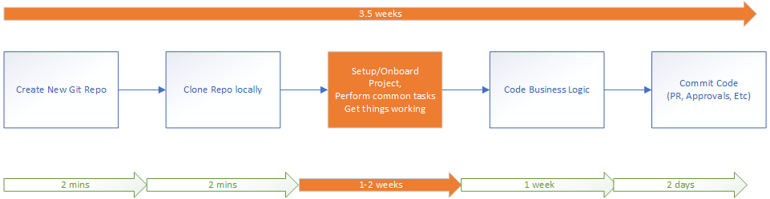
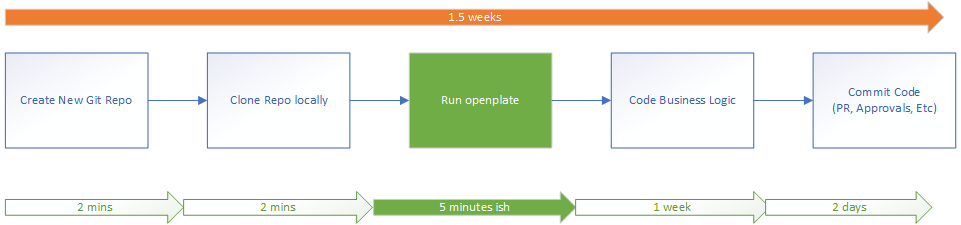
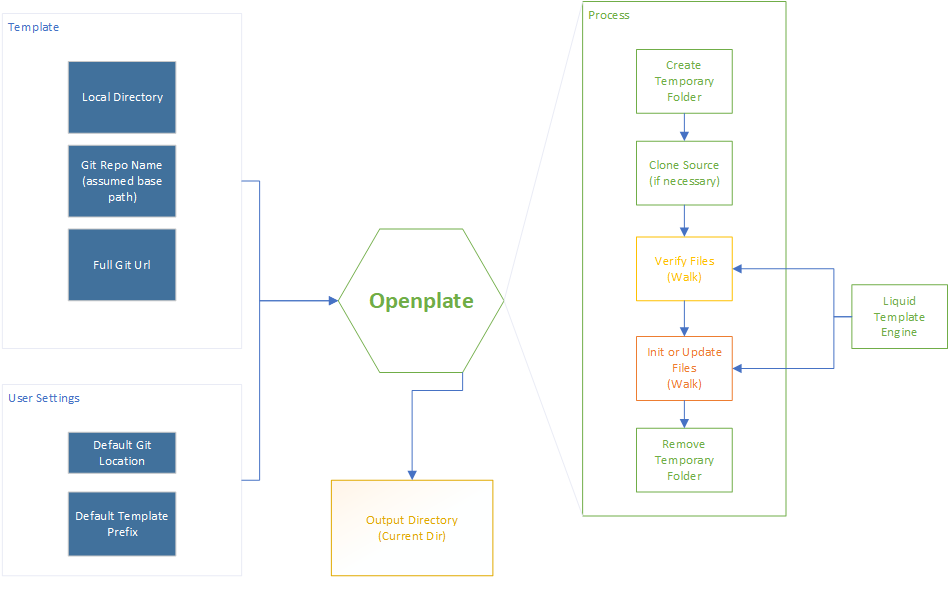

# Purpose
Openplate was created to solve a specific issue:
    
```
Reduce repetition of create/update tasks when making many small assets(microservices, micro-uis)
```

We wanted to change this:


Into this:


# Process
In order to achieve this we:
- Store our project templates in dedicated git repos
- Use them to generate assets with a single command on the CLI (openplate)


